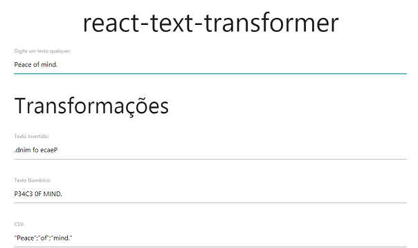

# Text Transformer
Desenvolvido como requisito para ser aprovado no trabalho prático do bootcamp Fullstack Developer do [IGTI](https://igti.com.br).

Esta aplicação é um conversor de texto que converte uma frase inserida pelo usuário nas seguintes formas:
- Invertida
- Numérica
- CSV
- Slug
- Somente vogais
- Somente consoantes
- CamelCase

## Instruções
Clone o projeto:
```bash
git clone https://github.com/madsoncoelho/React-Text-Transformer.git
```

Entre na pasta do projeto e instale as dependências:
```bash
yarn
```

Execute a aplicação:
```bash
yarn start
```

Insira uma frase no primeiro campo de texto e veja as conversões.

## Tecnlogias utilizadas
- HTML
- CSS
- Javascript
- [Materialize CSS](https://materializecss.com/)

## Screenshots

